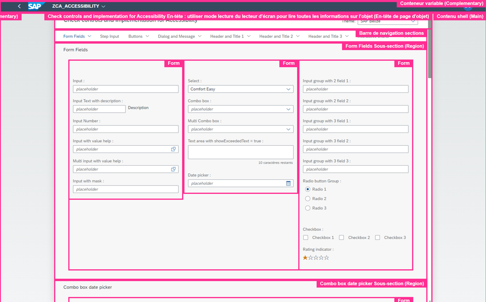
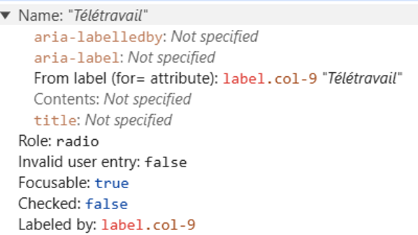
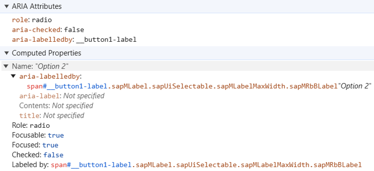

# 📝 Exercise - #1 Role

## 📚 Introduction

Roles provide **semantic meaning** to content, allowing screen readers and other tools to present and support interaction with an object in a way that is consistent with user expectations of that type of object.

---

## 🔧 Usage

ARIA roles can be used to describe elements that don't natively exist in HTML or exist but don't yet have full browser support.

By default, many semantic elements in HTML have a role, for example:

```html
<input type="radio"> <!-- has the "radio" role -->
```

Non-semantic elements in HTML do not have a role;  
`<div>` and `<span>` without added semantics return null. The **role attribute provides semantics** to them.

---

## 📂 Categories of ARIA Roles

- **Document structure roles**: e.g. Toolbar, Tooltip, Presentation/None, Feed
- **Widget roles**: e.g. Searchbox, Slider, Spinbutton, Switch, Tab, Combobox, Menu
- **Landmark roles**: e.g. Banner, Contentinfo, Main, Navigation, Region, Search
- **Live region roles**: e.g. Alert, Status, Timer
- **Window roles**: e.g. Alertdialog, Dialog

🔗 **Resources:**
- [Mozilla ARIA Roles](https://developer.mozilla.org/en-US/docs/Web/Accessibility/ARIA/Roles)
- [WAI ARIA Roles](https://www.w3.org/WAI/ARIA/apg/practices/)

---

## 🖼️ Landmark Roles Examples



---

## 📖 UI5 API Documentation

You can find the list of the roles used by UI5 in:

- [AccessibleRole](https://sapui5.hana.ondemand.com/1.108.39/#/api/sap.ui.core.AccessibleRole%23properties)
- [AccessibleLandmarkRole](https://sapui5.hana.ondemand.com/1.108.39/#/api/sap.ui.core.AccessibleLandmarkRole)

---

## 🔬 Comparison of Generated HTML

Below is a **comparison of radio button implementations** in AngularJS vs UI5:

### 🔹 Radio Button in AngularJS

```html
<input _ngcontent-xxa-c185 id="typePresence_2" type="radio" name="typePresenceRadio" class="ng-untouched ng-pristine ng-valid">
```


Generates an:

```html
<input type="radio">
```

---

### 🔹 Radio Button in UI5

```html
<div id="__button1" data-sap-ui="__button1" role="radio" aria-checked="false" aria-labelledby="__button1-label" tabindex="-1" class="sapMRb sapMRbHasLabel"> flex
</div>
```



Generates a:

```html
<div role="radio"></div>
```

---

## 📝 Role - Exercises

### 🎯 Objectives

Learn to manipulate **Roles**:

- Change a Link role into a Button role
- Add more information to the role of buttons that open dialogs
- Define Landmark Roles to structure a page

---

### 📋 Instructions
- If you haven’t done so already, launch the application
- Carry out the exercises **from #1 to #3** (You need to go back to the tab displaying the application: the instructions are shown directly there)
- Use the screen reader to validate your work: You have to use keyboard navigation (positionate with arrow keys x Tab)
- Whenever you are stuck, you can get help by clicking on:

- A password to access the complete solution will be provided by the instructors at some point
- For Landmark Roles you can also use these extensions:
  - [Landmark Navigation via Keyboard (Recommended)](https://chromewebstore.google.com/detail/landmark-navigation-via-k/ddpokpbjopmeeiiolheejjpkonlkklgp)
  - [Web Developer](https://chromewebstore.google.com/detail/web-developer/bfbameneiokkgbdmiekhjnmfkcnldhhm)

---

  ### ✅ Landmark Navigation Extension Setup (Exercise 3)

Once installed:

1. Go to **Preferences / Options** in the extension settings.
2. Set **“Border and label appearance”** to **“Persistent”**.  
➔ Keeps landmark borders and labels always visible, even after navigation.  
✔️ Useful for testing to see exactly which landmark is active.
3. Check **“Close the pop-up immediately when activating a landmark button”**.  
➔ Automatically closes the pop-up after selecting a landmark.  
✔️ Makes testing faster and more efficient.

💡 **Summary:**  
These settings make landmark navigation testing **easier and quicker** by keeping visual indicators visible and reducing extra steps.

---

### 🧭 Navigating through Landmarks with NVDA (Exercise 3)

Before navigating through landmarks, make sure NVDA is in Browse Mode.
You can switch between Browse Mode and Focus Mode using:
| Action | NVDA Shortcut |
|---|---|
| Navigate to the **next landmark** | `NVDA + Space` |

> 💡 **Reminder:** The NVDA key is usually Caps Lock, depending on your NVDA configuration.

> 👁️ **Optional - Enable Visual Highlight**
>
> If you want some visual feedback while using NVDA, you can enable **Visual Highlight**.
>
> Go to **NVDA Preferences → Settings → Vision → Visual Highlight** and enable it.
>
> This highlights the element or area currently being navigated, making it easier to understand what NVDA is focusing on while listening to the screen reader.


Once in Browse Mode, use:

| Action | NVDA Shortcut |
|---|---|
| Navigate to the **next landmark** | `D` |
| Navigate to the **previous landmark** | `Shift + D` |

NVDA should announce the **role** and, when available, the **accessible name** of each landmark.

For example, you may hear announcements such as:

```text
Product Header, region
Product Description, main landmark
Product Footer, region
```

> 💡 **Important:** `Tab` and Landmark navigation serve different purposes.
>
> `Tab` navigates between **focusable interactive elements**.
>
> Landmark navigation allows screen reader users to navigate through the **structure of the page**.

---

| # | Exercise | Objective |
|---|----------|-----------|
| 1 | Modify Link role into a Button role | Learn how to change Link Role into **Button Role** |
| 2 | Define `ariaHasPopup` | Learn the importance of assigning the **ariaHasPopup** property to buttons that trigger popups, menus, or lists. |
| 3 | Define Landmarks | Learn how to use **Landmarks** to identify the different sections of a web page clearly and make it easier to navigate using assistive technologies. |

> 💡 **Hint: Understanding `PageAccessibleLandmarkInfo`**
>
> Think of landmarks as a **map of your page for screen reader users**.
>
> Each property of `PageAccessibleLandmarkInfo` corresponds to a specific area of `sap.m.Page`:
>
> ```text
> Page → rootRole="Region"
> │      "Product Details"
> │
> ├── Header → headerRole="Region"
> │             "Product Header"
> │
> ├── SubHeader → subHeaderRole="Region"
> │                "Category Description"
> │
> ├── Content → contentRole="Main"
> │              "Product Description"
> │
> └── Footer → footerRole="Region"
>               "Product Footer"
> ```
>
> | Property | Part of `sap.m.Page` | What it tells the screen reader |
> |---|---|---|
> | `rootRole` | Entire `Page` | "This page is an identifiable region" |
> | `headerRole` | `customHeader` / header | "This area is a region" |
> | `subHeaderRole` | `subHeader` | "This area is a region" |
> | `contentRole` | `content` | "This is the main content" |
> | `footerRole` | `footer` | "This area is a region" |
> | `xxxLabel` | Accessible name of the area | Gives the landmark a meaningful name that can be announced by the screen reader |
>
> Without landmarks, a screen reader can still read the individual elements, but it has less information about how the page is structured.
>
> By defining roles such as `Main` or `Region` and giving them meaningful labels, you identify the important areas of the page. Screen reader users can then understand the page structure and navigate directly between these areas instead of going through every single control.
>
> ⚠️ **Remember:** More landmarks don't necessarily mean better accessibility. Use them to identify meaningful sections of the page.
---

[Go to next part: #2 Accessible Name](accessible_name.md)
